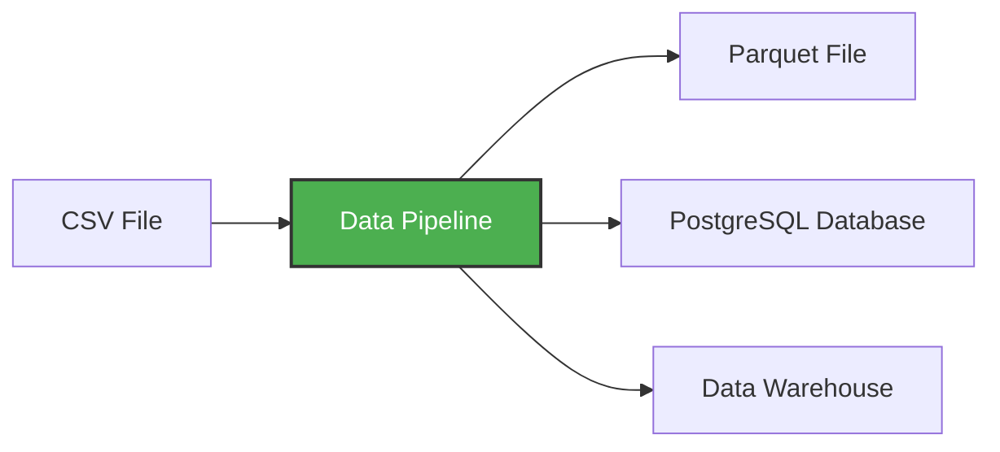

A **data pipeline** is a service that receives data as input and outputs more data. For example, reading a CSV file, transforming the data somehow and storing it as a table in a PostgreSQL database.

In this workshop, we'll build pipelines that:
- Download CSV data from the web
- Transform and clean the data with pandas
- Load it into PostgreSQL for querying
- Process data in chunks to handle large files
